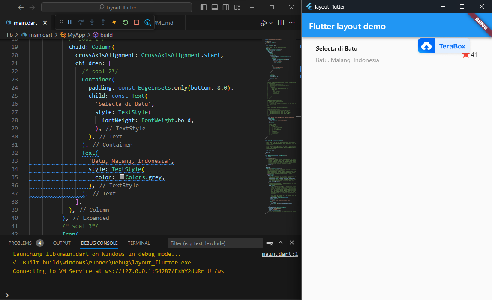
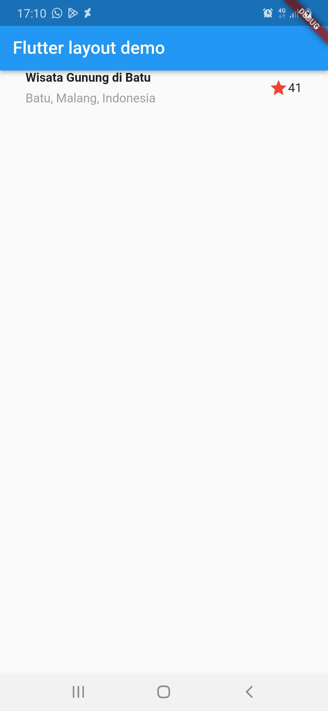
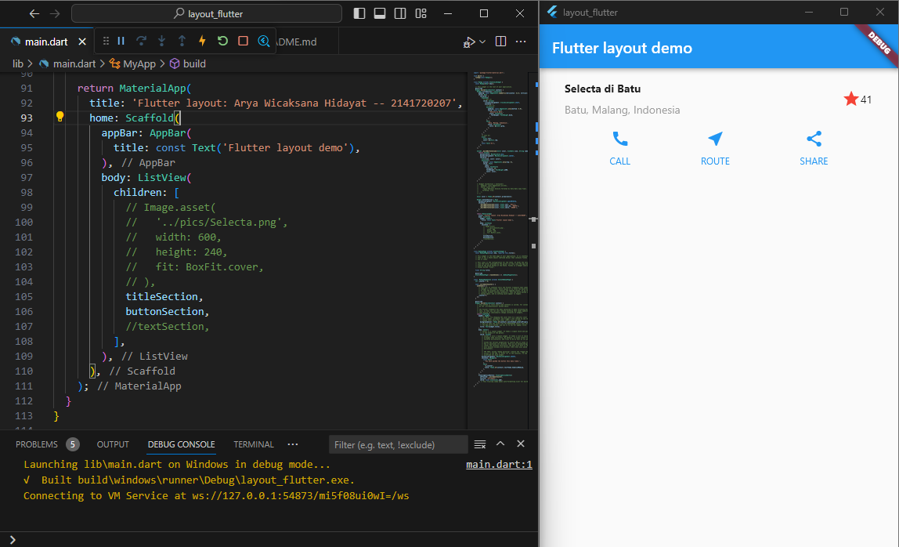
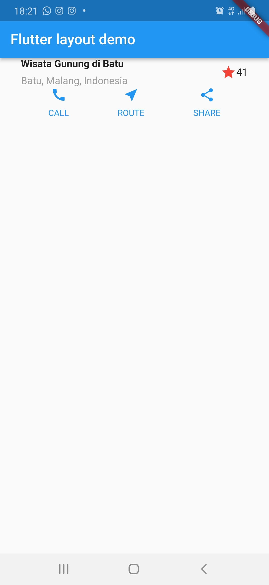
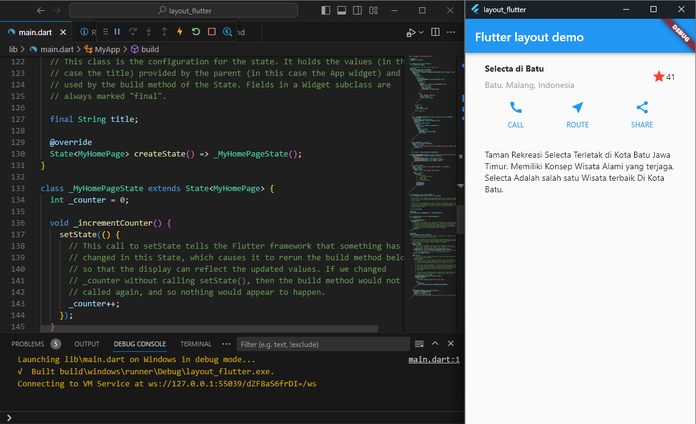
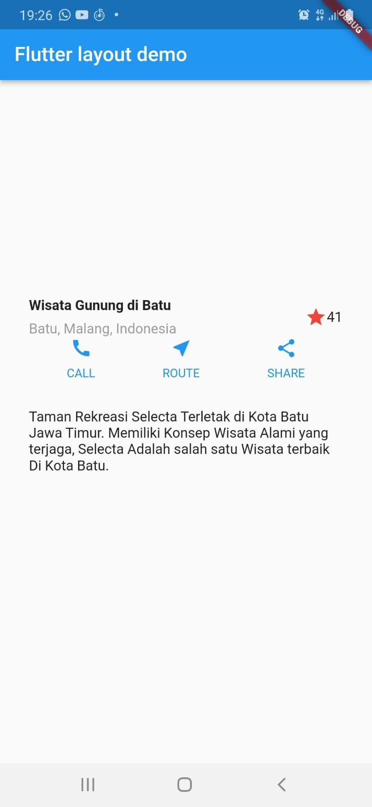
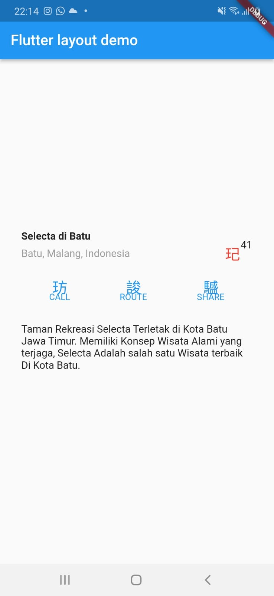

# Praktikum 1: Membangun Layout di Flutter

# Buka file lib/main.dart

    import 'package:flutter/material.dart';

    void main() => runApp(const MyApp());

    class MyApp extends StatelessWidget {
    const MyApp({super.key});

    @override
    Widget build(BuildContext context) {
        return MaterialApp(
        title: 'Flutter layout: Nama dan NIM Anda',
        home: Scaffold(
            appBar: AppBar(
            title: const Text('Flutter layout demo'),
            ),
            body: const Center(
            child: Text('Hello World'),
            ),
        ),
        );
    }
    }

my code : (find line 11)

    @override
    Widget build(BuildContext context) {
        return MaterialApp(
        title: 'Flutter layout: Arya Wicaksana Hidayat -- 2141720207',
        home: Scaffold(
            appBar: AppBar(
            title: const Text('Flutter layout demo'),
            ),
            body: Column(
            children: children: [titleSection],
            ),
        ),
        );
    }

# Implementasi title row

    Widget titleSection = Container(
    padding: const EdgeInsets.all(...),
    child: Row(
        children: [
        Expanded(
            /* soal 1*/
            child: Column(
            crossAxisAlignment: ...,
            children: [
                /* soal 2*/
                Container(
                padding: const EdgeInsets.only(bottom: ...),
                child: const Text(
                    'Wisata Gunung di Batu',
                    style: TextStyle(
                    fontWeight: FontWeight.bold,
                    ),
                ),
                ),
                Text(
                'Batu, Malang, Indonesia',
                style: TextStyle(...),
                ),
            ],
            ),
        ),
        /* soal 3*/
        Icon(
        ...,
            color: ...,
        ),
        const Text(...),
        ],
    ),
    );

my code : (put above return MaterialApp)

    Widget titleSection = Container(
      padding: const EdgeInsets.symmetric(horizontal: 32.0, vertical: 16.0),
      child: Row(
        children: [
          Expanded(
            /* soal 1*/
            child: Column(
              crossAxisAlignment: CrossAxisAlignment.start,
              children: [
                /* soal 2*/
                Container(
                  padding: const EdgeInsets.only(bottom: 8.0),
                  child: const Text(
                    'Selecta di Batu',
                    style: TextStyle(
                      fontWeight: FontWeight.bold,
                    ),
                  ),
                ),
                Text(
                  'Batu, Malang, Indonesia',
                  style: TextStyle(
                    color: Colors.grey,
                  ),
                ),
              ],
            ),
          ),
          /* soal 3*/
          Icon(
            Icons.star,
            color: Colors.red,
          ),
          const Text('41'),
        ],
      ),
    );

# Praktikum 2: Implementasi button row

(put between titleSection and textSection)

    class MyApp extends StatelessWidget {
    const MyApp({super.key});

    @override
    Widget build(BuildContext context) {
        // ···
    }

    Column _buildButtonColumn(Color color, IconData icon, String label) {
        return Column(
        mainAxisSize: MainAxisSize.min,
        mainAxisAlignment: MainAxisAlignment.center,
        children: [
            Icon(icon, color: color),
            Container(
            margin: const EdgeInsets.only(top: 8),
            child: Text(
                label,
                style: TextStyle(
                fontSize: 12,
                fontWeight: FontWeight.w400,
                color: color,
                ),
            ),
            ),
        ],
        );
    }
    }

# Langkah 2: Buat widget buttonSection

put between textSection and MaterialApp

    Color color = Theme.of(context).primaryColor;

    Widget buttonSection = Row(
    mainAxisAlignment: MainAxisAlignment.spaceEvenly,
    children: [
        _buildButtonColumn(color, Icons.call, 'CALL'),
        _buildButtonColumn(color, Icons.near_me, 'ROUTE'),
        _buildButtonColumn(color, Icons.share, 'SHARE'),
    ],
    );

# Tambah button section ke body

find "==> <=="

    return MaterialApp(
      title: 'Flutter layout: Arya Wicaksana Hidayat -- 2141720207',
      home: Scaffold(
        appBar: AppBar(
          title: const Text('Flutter layout demo'),
        ),
        ==>body: const Center(
          child: Text('Hello World'),
        )<==,
      ),
    );

and change it into...

    return MaterialApp(
      title: 'Flutter layout: Arya Wicaksana Hidayat -- 2141720207',
      home: Scaffold(
        appBar: AppBar(
          title: const Text('Flutter layout demo'),
        ),
        body: ListView(
          children: [
            titleSection,
            buttonSection,
          ],
        ),
      ),
    );

# Praktikum 3: Implementasi text section

# Buat widget textSection

    Widget textSection = Container(
    padding: const EdgeInsets.all(32),
    child: const Text(
        'Carilah teks di internet yang sesuai '
        'dengan foto atau tempat wisata yang ingin '
        'Anda tampilkan. '
        'Tambahkan nama dan NIM Anda sebagai '
        'identitas hasil pekerjaan Anda. '
        'Selamat mengerjakan 🙂.',
        softWrap: true,
    ),
    );

my code : (put between titleSection and MaterialApp)

    Widget textSection = Container(
      padding: const EdgeInsets.all(32),
      child: const Text(
        'Taman Rekreasi Selecta Terletak di Kota Batu Jawa Timur. Memiliki Konsep Wisata Alami yang terjaga, Selecta Adalah salah satu Wisata terbaik Di Kota Batu.',
        softWrap: true,
      ),
    );

# Tambahkan variabel text section ke body

    return MaterialApp(
      title: 'Flutter layout: Arya Wicaksana Hidayat -- 2141720207',
      home: Scaffold(
        appBar: AppBar(
          title: const Text('Flutter layout demo'),
        ),
        body: ListView(
          children: [
            titleSection,
            buttonSection,
            ==>textSection<==,
          ],
        ),
      ),
    );

# Praktikum 4: Implementasi image section

# Siapkan aset gambar

go to pubspec.yaml and find line 61

    # To add assets to your application, add an assets section, like this:
    # assets:
    #   - images/a_dot_burr.jpeg
    #   - images/a_dot_ham.jpeg

change it into...

      # To add assets to your application, add an assets section, like this:
    assets:
    - pics/Selecta.png
    #   - images/a_dot_burr.jpeg
    #   - images/a_dot_ham.jpeg

pic usually won't appear even you copied the right path, idk how to fix

# Tambahkan gambar ke body

    body: ListView(
          children: [
            ==>Image.asset(
              '../pics/Selecta.png',
              width: 600,
              height: 240,
              fit: BoxFit.cover,
            ),<==
            titleSection,
            buttonSection,
            textSection,
          ],
        ),

# Terakhir, ubah menjadi ListView

    body: ==>ListView<==
          children: [
            Image.asset(
              '../pics/Selecta.png',
              width: 600,
              height: 240,
              fit: BoxFit.cover,
            ),
            titleSection,
            buttonSection,
            textSection,
          ],

I don't understand how it became a chinese